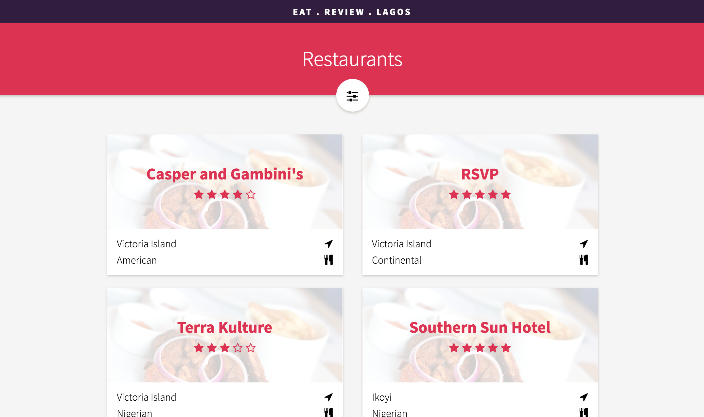
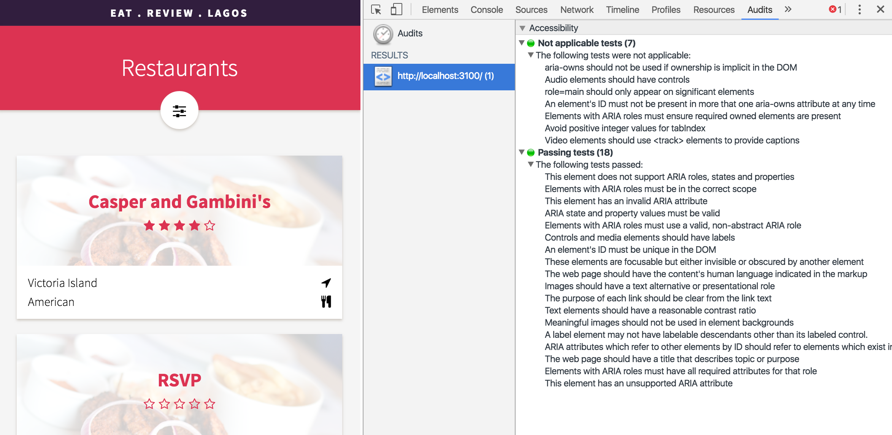

# Restaurant Reviewer Application

Project #3 for the [Udacity Senior Web Developer Nanodegree](https://www.udacity.com/course/senior-web-developer-nanodegree--nd802)

Passed on 17 July 2016

## Project Brief

You must build a restaurant reviews application with a focus on accessibility. The application must include restaurant names, a photograph, address and operating hours for each restaurant along with reviews, including the name of the reviewer, date of review, 5-star rating system, and comments. The application must include an application header, a menu providing multiple ways to filter the restaurants. When viewing a specific restaurant, current reviews must be displayed along with a form for the user to submit their own review.

### Requirements

- App includes all requirements, including restaurant information, customer reviews and a new review form.
- App is equally functional on mobile and desktop, using **responsive design** to ensure its displayed in a useable state.
- All content-related images include appropriate alternate text.
- Focus is appropriately managed allowing users to noticeably tab through each of the important elements of the page. 
- Modal or interstitial windows appropriately lock focus.
- Elements on the page use the appropriate semantic elements. For those elements in which a semantic element is not available, appropriate ARIA roles are defined.
- Color selections and contrast are made with accessibility in mind.
- App includes a build process (such as Grunt or Gulp). Assets are minimized and concatenated as appropriate.

## My App - Eat.Review.Lagos

### Accessibility Tests

